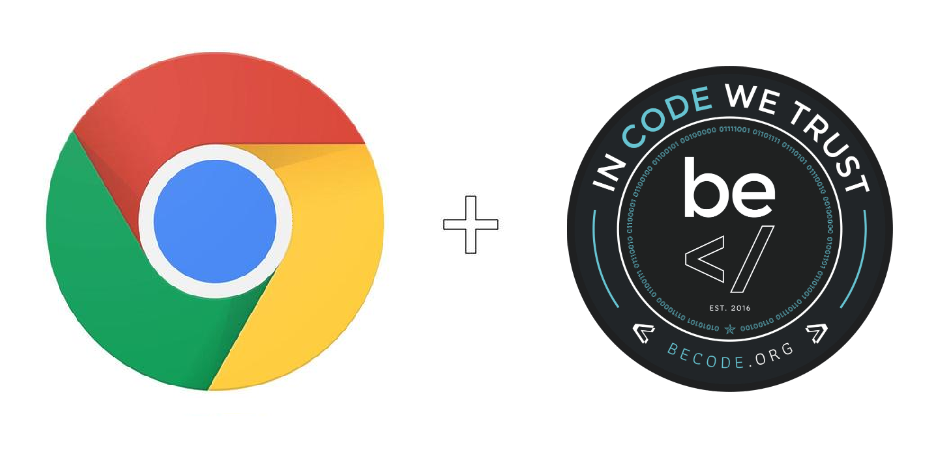

<p align="center">
  
</p>

# Sneak peek

Manage your favorite links, be aware of upcoming watches, be notified if there are none and have the ability to add one.

## The problematic

It's hard to know what other Becode groups are going through, but if your way of managing watches was the same as ours, you're dealing with a real pain in the ass.

How do we get this thorn out of our feet?

## "BecodeCE", our upcoming chrome extension.

The purpose of this extension is to gather all the resources useful to our life at Becode.

But the real challenge is to allow it to check the ".md" agenda of our watches, to display the watches of the day and to warn us if the next slot is empty. 
In which case: :sos: **ALERT** :sos:

How are we going to do that? 

That's your problem now !

*But here is what we already did ;*

For now, the fetch of the "agenda.md" is done with "node-fetch", by placing your personal token in a "myToken" variable (defined in fetch_github.js).
All this is temporary, we will receive a beautiful Becode GraphQL API that will allow us to receive the calendars in a **much much** cleaner way.

Also, the following command will return the watch of the day :
```
$ node fetch_github.js
```
Finally, we've added a bit of CSS, to make it easier to develop the functionalities.
Look at it, it's dreadful. 
"margin-left" in px and all. I know.

Rest assured, a SASS master will eventually reveal himself among the Becodians.

## What should we do now ?

This extension will no longer be worked on by the Hamilton 2-12 group. It is now up to other groups to develop, improve and transform it in the way they want.

I invite you to collaborate on this project **"made in Becode"** and to push it as far as possible. The following groups will take over.

*"Unity makes strength"* is the motto.
